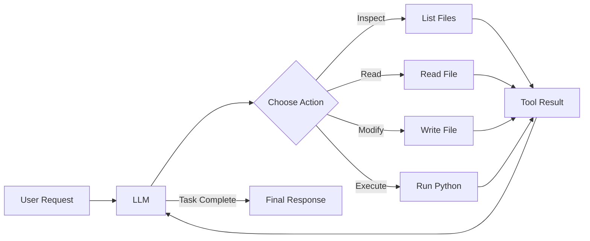
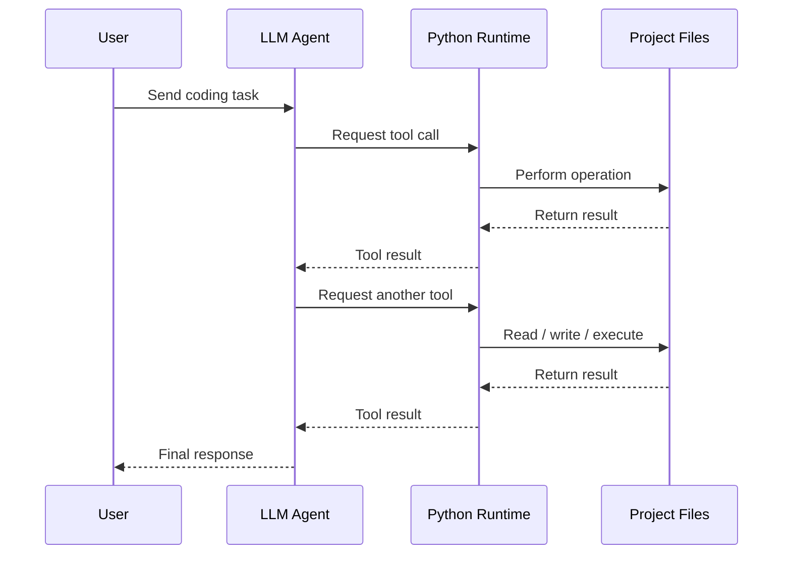

# AI Coding Agent

A Python-based autonomous coding agent that uses an LLM to inspect files, read and modify code, execute Python programs, and iteratively solve programming tasks using a tool-calling feedback loop.



Built as part of the **Boot.dev AI Agent project** and developed as a practical exploration of agentic AI, tool calling, filesystem interaction, code execution, and automated debugging.

---

## Overview

The project demonstrates how an LLM can act as the reasoning layer of a coding agent while a Python application controls the actions that are actually executed.

The model itself does not directly access the filesystem or execute code.

Instead, it:

1. Receives a user request
2. Decides which tool it needs
3. Returns a structured tool call
4. Python executes the requested function
5. The result is returned to the LLM
6. The LLM decides what to do next
7. The process repeats until the task is complete

This creates a basic autonomous agent loop similar in concept to the systems used by modern AI coding assistants.

---

## Capabilities

The agent can:

- List files and directories
- Read file contents
- Create and overwrite files
- Execute Python files
- Pass command-line arguments to Python programs
- Select tools automatically based on a user request
- Receive tool results and continue reasoning
- Investigate codebases
- Diagnose bugs
- Modify source code
- Run tests
- Verify its own fixes

---

## Autonomous Bug Fix Example

The project includes a calculator application used to test the agent.

A bug was deliberately introduced by changing the precedence of the `+` operator.

The calculator incorrectly evaluated:

```text
3 + 7 * 2 = 20
```

instead of:

```text
3 + 7 * 2 = 17
```

The agent was then given:

```text
Fix the bug: 3 + 7 * 2 shouldn't be 20.
```

Without being told where the bug was located, the agent:

1. Inspected the project structure
2. Read relevant source files
3. Investigated the calculator implementation
4. Identified the incorrect operator precedence
5. Modified the source code
6. Executed the calculator
7. Ran the test suite
8. Verified the corrected result

Example agent activity:

```text
- Calling function: get_files_info
- Calling function: get_file_content
- Calling function: get_file_content
- Calling function: get_files_info
- Calling function: get_file_content
- Calling function: write_file
- Calling function: run_python_file
- Calling function: run_python_file
- Calling function: run_python_file

Final response:
The bug is fixed.
```

The corrected expression returned:

```text
17
```

---

## Agent Architecture

The core agent operates as a feedback loop:



Each iteration adds both the assistant's tool request and the resulting tool response back into the conversation history.

This allows the model to reason about the results of its previous actions instead of making a single isolated function call.

---

## Available Tools

### `get_files_info`

Lists items within a directory.

Returns information including:

```text
- main.py: file_size=749 bytes, is_dir=False
- pkg: file_size=192 bytes, is_dir=True
```

---

### `get_file_content`

Reads the contents of a file.

Large files are limited to a configured maximum number of characters to prevent unnecessarily large amounts of text being sent to the LLM.

---

### `write_file`

Creates or overwrites files within the permitted working directory.

The tool can also create missing parent directories when required.

---

### `run_python_file`

Executes Python files with optional command-line arguments.

Execution is limited by a timeout to prevent programs from running indefinitely.

Example:

```text
run_python_file(
    file_path="main.py",
    args=["3 + 5"]
)
```

---

## Tool Calling

Each Python function is exposed to the model using an OpenAI-compatible JSON schema.

For example:

```python
schema_get_files_info = {
    "type": "function",
    "function": {
        "name": "get_files_info",
        "description": "Lists files in a specified directory relative to the working directory",
        "parameters": {
            "type": "object",
            "properties": {
                "directory": {
                    "type": "string",
                    "description": "Directory path relative to the working directory",
                }
            },
        },
    },
}
```

The LLM does not execute this function directly.

Instead, it may respond with a structured request equivalent to:

```text
get_files_info({"directory": "pkg"})
```

The Python application receives that request, executes the function, and returns the result to the model.

---

## Security Boundaries

The agent is intentionally restricted to a predefined working directory.

The LLM does not control this value.

Paths are normalized and validated before filesystem operations are allowed.

For example, attempts to access locations such as:

```text
../
/bin
/tmp
```

are rejected.

The underlying path validation uses:

```python
os.path.abspath()
os.path.join()
os.path.normpath()
os.path.commonpath()
```

The application verifies that the requested target remains inside the permitted working directory before allowing an operation.

Python execution also has a timeout:

```python
timeout=30
```

This prevents accidentally launched programs from running indefinitely.

> **Security Notice**
>
> This is an educational coding agent, not a production sandbox.
>
> Allowing an LLM to modify files and execute code carries significant security risk. The project should only be used in controlled environments and should never be given access to sensitive files or systems.

---

## Tech Stack

- Python
- OpenAI Python SDK
- OpenRouter
- LLM tool calling
- JSON Schema
- `subprocess`
- Python filesystem APIs
- `uv`
- `python-dotenv`
- Git
- GitHub

---

## Project Structure

```text
ai-agent/
├── calculator/
│   ├── main.py
│   ├── tests.py
│   └── pkg/
│       ├── calculator.py
│       └── render.py
│
├── functions/
│   ├── get_files_info.py
│   ├── get_file_content.py
│   ├── write_file.py
│   └── run_python_file.py
│
├── call_function.py
├── config.py
├── main.py
├── prompts.py
├── pyproject.toml
├── uv.lock
└── README.md
```

---

## Getting Started

### Clone the repository

```bash
git clone https://github.com/Ajmoylan/ai-agent.git
cd ai-agent
```

### Install dependencies

Using `uv`:

```bash
uv sync
```

### Configure OpenRouter

Create a `.env` file in the project root:

```text
OPENROUTER_API_KEY=your_api_key_here
```

The `.env` file is excluded from Git and should never be committed.

---

## Running the Agent

Use:

```bash
uv run main.py "your request here"
```

For additional diagnostic information:

```bash
uv run main.py "your request here" --verbose
```

---

## Example Prompts

Inspect the project:

```bash
uv run main.py "What files are in the pkg directory?"
```

Ask the agent to explain code:

```bash
uv run main.py "Explain how the calculator renders its output."
```

Run tests:

```bash
uv run main.py "Run the calculator tests."
```

Create a file:

```bash
uv run main.py "Create a file called hello.txt containing Hello World."
```

Debug a program:

```bash
uv run main.py "Fix the bug: 3 + 7 * 2 shouldn't be 20."
```

---

## How the Feedback Loop Works

A conventional chatbot might follow this pattern:

```text
User
  |
  v
LLM
  |
  v
Response
```

This project instead uses:

```text
User
  |
  v
LLM
  |
  v
Tool Request
  |
  v
Python Function
  |
  v
Tool Result
  |
  +----------+
             |
             v
            LLM
             |
             v
        Next Action
             |
             v
        Final Response
```

The loop currently allows up to 20 iterations before terminating.

This prevents the agent from continuing indefinitely if it becomes stuck.

---

## What I Learned

This project provided practical experience with:

- Agentic AI architecture
- LLM function calling
- Tool schemas
- Multi-step agent loops
- Conversation state
- Prompt engineering
- Filesystem security boundaries
- Python subprocess execution
- Automated debugging
- Error handling
- Context management
- LLM-driven decision making

One of the most important concepts demonstrated by this project is the separation between **reasoning** and **execution**.

The LLM decides what action it would like to perform.

The Python application decides whether that action is allowed and performs it.

---

## Future Improvements

Potential extensions include:

- Git-aware agent tools
- Automatic diffs before file modifications
- Human approval before destructive changes
- Automatic commits after successful fixes
- Rollback support
- More sophisticated test execution
- Better sandboxing
- Structured logging
- Agent execution traces
- Token and cost monitoring
- Additional programming language support
- Model selection and fallback strategies
- Automated agent evaluation
- Retrieval-augmented project documentation
- Multiple specialised agents
- Persistent task memory

---

## Disclaimer

This project was created for educational purposes while learning about autonomous coding agents, LLM tool calling, and agentic AI.

It is intentionally simplified and should not be treated as production-grade agent infrastructure.

---

## Author

**Alex Moylan**

Computing & IT graduate focused on software engineering, AI applications, LLMs, RAG, tool calling, and agentic systems.

[GitHub](https://github.com/Ajmoylan)
